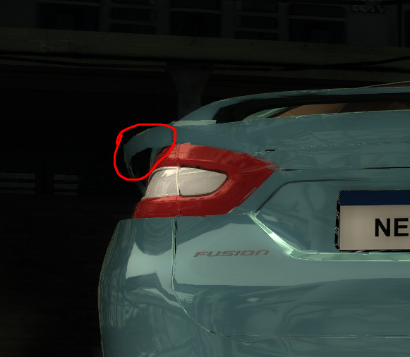
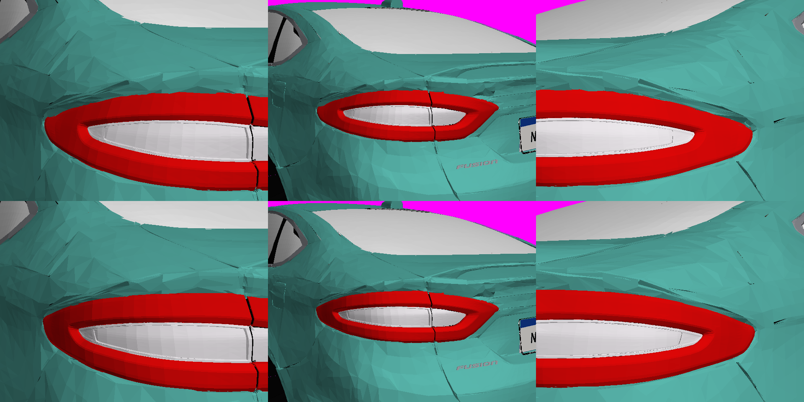
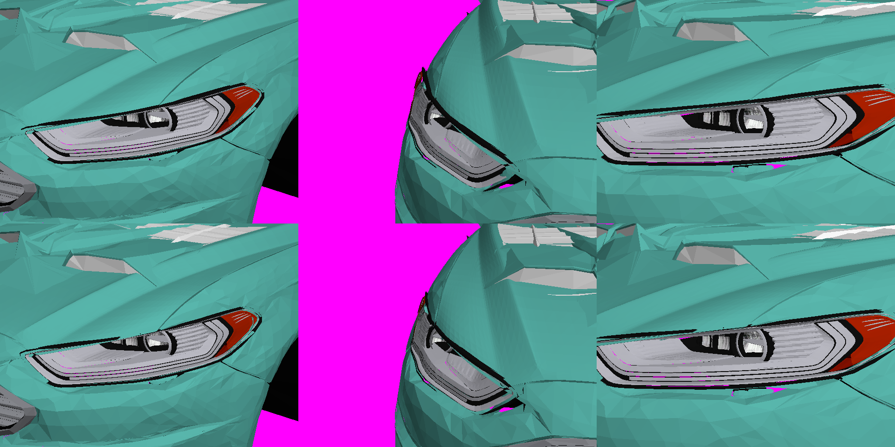
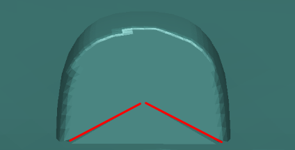
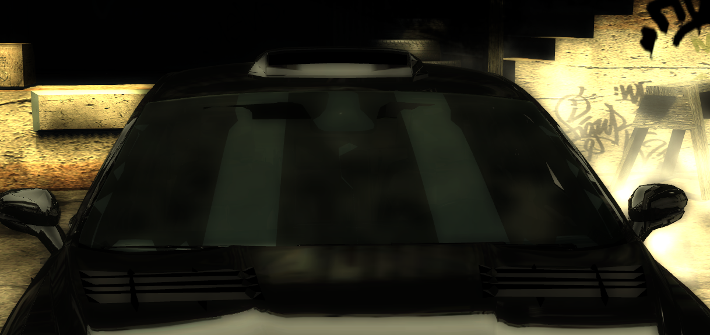
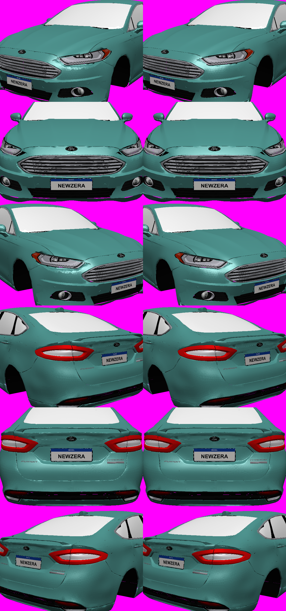
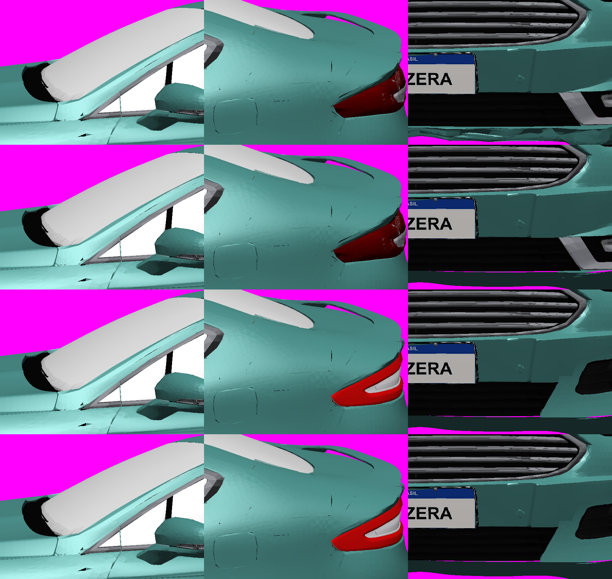
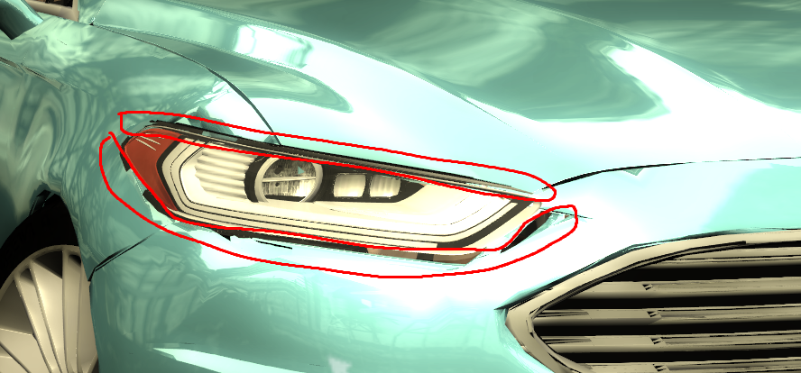
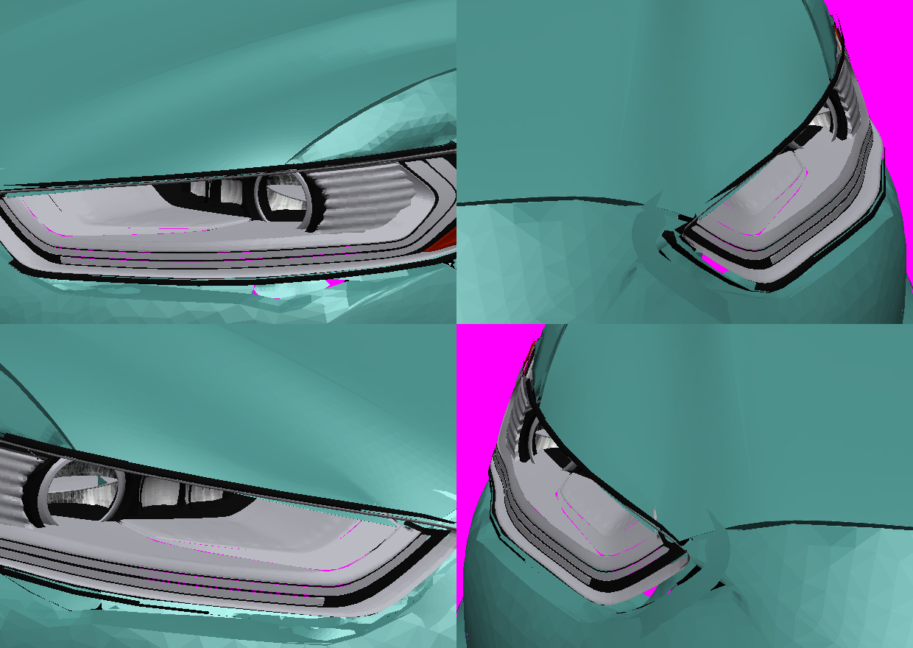
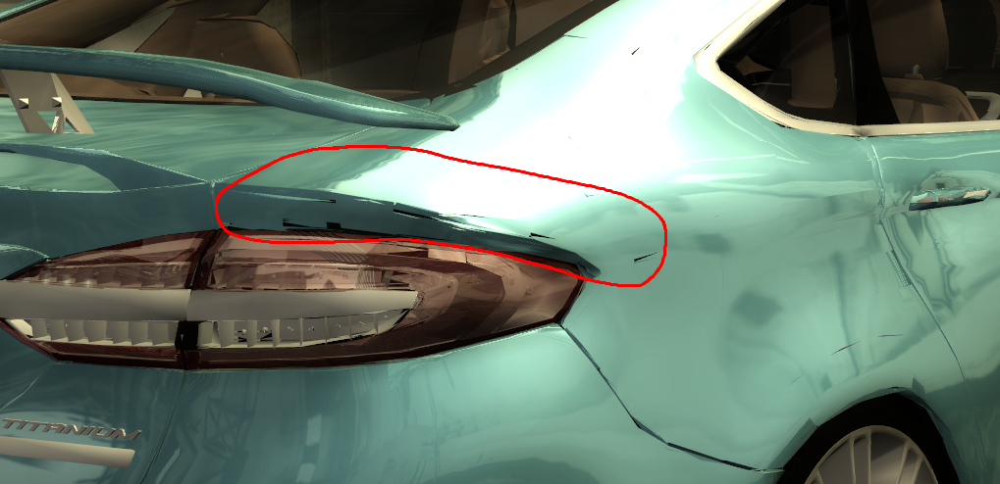

# Aprendizados — Fusion Titanium 2018 no NFS Most Wanted 2005

Documento consolidado em 24/09/2026, depois da aprovação da **V1prime-d** no jogo ("vidros, janelas,
rodas, cromados, grade frontal, grade do escapamento, faróis, tudo").

| Item | Valor |
| --- | --- |
| Versão aprovada | `versions/v1prime/release/MUSTANGGT` |
| GEOMETRY.BIN | `C8A2D660B3A8031AA31FF9A61095F4A8A36366A520D162866B2F428E4311C5FB` |
| TEXTURES.BIN | `BF9A08426FB00AD40784558E99A179715B8FE916E58CF3A46F97673566B847D8` |
| Slot | `MUSTANGGT`, instalado em `CARS/MUSTANGGT` e em `ADDONS/CARS_REPLACE/MUSTANGGT` |
| Base | vprime (backup local `work/backup/fusion-mw2005.7z` de 20/09 03:10): catálogo AJM3899 com 64 sólidos e carroceria 2018 montada a partir dos drawables do GTA V |

---

## 1. O problema principal: texturas DXT3 tornavam as peças "translúcidas"

### Sintomas (todos com a mesma causa)

- grade frontal: aparecia só a borda; o miolo mostrava o motor ou o fundo;
- faróis e lanternas visíveis **através** do carro em alguns ângulos, e vice-versa;
- peças "sumindo" conforme o ângulo, sem padrão geométrico aparente.

### Causa

O MW 2005 decide como desenhar cada material pelo **formato da textura** no `TEXTURES.BIN`:

- **DXT1** (sem canal alfa): material **opaco**. O motor grava a profundidade de cada pixel
  (*z-buffer*). Uma peça que está atrás e é desenhada depois é descartada naquele pixel.
- **DXT3** (com canal alfa): material **translúcido**. O motor desenha com mistura de cores e
  **não grava profundidade**. Qualquer peça desenhada depois, mesmo estando atrás, pinta por cima.

Numa etapa anterior, as folhas `MISC`, `LOGO` e `INTERIOR` foram regravadas em **DXT3**, embora sejam
100 % opacas. No doador AJM original essas três são **DXT1**. Com isso, a grade (textura `MISC`) virou
"translúcida". O motor, o painel de fundo e o interior, desenhados depois, pintavam por cima dela.
Só sobrava visível o que não tinha nada desenhado depois atrás: a borda, o anel e o logotipo.

### A correção

Regravar `MISC`, `LOGO` e `INTERIOR` em **DXT1**, sem mexer na geometria e sem trocar shader.
Foi o que resolveu grade, cromados, grade do escapamento e a sensação de ver peças através do carro.

### Como o diagnóstico foi fechado (V1prime-c)

A grade foi pintada com cores sólidas em células livres da folha BADGING:

| Cor | Onde estava | Posição | Resultado no jogo |
| --- | --- | --- | --- |
| vermelho | barras e anel, em `RIGHT_SIDE_MIRROR_A` | na frente | só o anel apareceu |
| verde | painel de fundo, no mesmo sólido, desenhado depois | atrás das barras | cobriu as barras |
| magenta | cópia das barras em `BASE_A`, desenhada antes | 5 mm à frente | sumiu por baixo das outras |

O que foi desenhado por último sempre venceu, independentemente de estar na frente ou atrás. Isso só
acontece quando a profundidade não é gravada. A comparação com o TPK do AJM (DXT1) confirmou a causa.

### Sobre a ideia de "z-index"

A intuição estava certa em essência. O efeito é o mesmo de elementos com `z-index` fora de ordem, mas o
mecanismo é outro: não existe um número de camada por peça. Normalmente a GPU decide quem fica na frente
**pixel a pixel**, pela distância gravada no z-buffer. Quando o material é tratado como translúcido,
a distância não é gravada, e passa a valer a **ordem de desenho** (como no "algoritmo do pintor", ou num
HTML sem `z-index` em que o último elemento fica por cima). Por isso a solução não foi reordenar peças,
e sim fazer o motor voltar a tratá-las como opacas.

---

## 2. Limite de 65.535 índices por sólido

- Num sólido com vários grupos de material, a parte de um grupo que passa do índice **65.535** não é
  desenhada. Nas luzes da V2, `BASE_A` chegou a 75.687 índices e as lanternas sumiam.
- Na vprime, `BASE_A` tinha 78.144 índices; o grupo 4 (LOGO) começava em 38.646 e passava do limite.
- **Correção (V1prime-a):** mover o grupo 4 inteiro para o slot vazio `KIT00_RIGHT_SIDE_MIRROR_A`.
- Ferramenta: `versions/v1prime/scripts/beyond.py` pinta de vermelho o que passa do limite.
- Sozinho, isso **não** resolveu a grade. Só resolveu junto com o DXT1 da seção 1.
- Sólidos de grupo único acima do limite (`KIT00_BODY_A`, 119.901 índices) aparecem inteiros.

## 3. Placa: letras "CHAPINHA" em relevo

- A placa exportada do GTA tinha as letras **CHAPINHA em 3D**. A face da placa tinha buracos no formato
  das letras. No jogo sobravam pedaços das letras e da pintura atravessando a placa.
- **Correção (V1prime-b):**
  - apagar as letras (147 triângulos no LOD A, 129 no B e 26 no C);
  - trocar a face furada por uma face plana, com UV ajustado por mínimos quadrados para mostrar NEWZERA;
  - manter moldura e parafusos;
  - afastar a placa 10 mm do para-choque, nas duas placas e em todos os LODs.

## 4. Outros aprendizados do caminho (V2/V3)

- **Retrovisores duplicados (V2):** o catálogo Shelby trazia um par de retrovisores próprio, além do par
  incorporado à carroceria 2018. Voltar ao catálogo AJM resolve.
- **Organização do AJM:** a carroceria pintada fica em `BASE`. `RIGHT_SIDE_MIRROR` guarda grade,
  retrovisores 2010, frisos e chassi. `LEFT_SIDE_MIRROR_A` faz parte do interior. Os slots não
  correspondem ao nome.
- **Nomes de textura (V3):** a conclusão "nome fora do padrão não é desenhado" provavelmente era o
  mesmo efeito DXT3 da seção 1. Não usar mais como regra sem novo teste.
- **Normais invertidas:** inverter faces sem recalcular as normais escurece a pintura (capô da V3a).
- **Instalação:** há duas rotas (`CARS` e `ADDONS/CARS_REPLACE` do Mod Loader). Com o jogo aberto, a
  pasta ADDONS fica travada e a cópia falha com "Permission denied". Feche o jogo, espere alguns
  segundos e confira o SHA-256 nas duas rotas.
- **Vprime:** é a melhor base. As tentativas V2 (Shelby) e V3 (reconstrução) pioraram a carroceria.

## 5. Checklist para novas peças e versões

1. **Textura:** peça opaca usa **DXT1**. DXT3 só para vidro ou onde o alfa é realmente usado.
   Conferir com `scripts/validator` (campo `Format`: `31545844` = DXT1, `33545844` = DXT3).
2. **Índices:** nenhum grupo de sólido com vários grupos pode ultrapassar 65.535 índices
   (`beyond.py`). Se passar, dividir em outro slot.
3. **Geometria importada do GTA:** procurar texto em relevo, peças sobrepostas e superfícies
   atravessando outras (placa, emblemas).
4. **Teste de cores:** quando uma peça não aparece, pintá-la com cores sólidas em células livres de
   uma folha opaca (`BuildDiag.cs`) e ver o que o jogo desenha.
5. **Instalação:** jogo fechado, duas rotas, conferir SHA-256, reabrir o jogo.

## 6. Ferramentas usadas (sem Windows)

| Tarefa | Como |
| --- | --- |
| Compilar e ler GEOMETRY | PowerShell 7 (.NET 8) compilando `tools/mwgc/RealGeometry.cs` com os scripts C#: `scripts/mw.ps1` |
| Montar TPK | fontes do `mwtc` sem System.Drawing: `scripts/mwtc.ps1` (reconstrução do TPK V2 byte a byte idêntica) |
| Validar | `Validator.dll` existente: `scripts/val.ps1` |
| Visualizar | rasterizador Python com backface culling (`render.py`, `partcolor.py`, `simgame.py`) |
| Codificar texturas | DXT1/DXT3 em numpy: `scripts/dxt.py` |

Os scripts estão em `versions/v3-fusion-ajm3899/scripts` e `versions/v1prime/scripts`.

## 7. Vinis desalinhados entre painéis (V1prime-e)

- Vinis e adesivos do MW usam as **UVs do grupo de pintura (CARSKIN)**. UVs herdadas do GTA V mapeiam
  cada painel separadamente, e o adesivo "quebra" entre a porta dianteira e a traseira.
- Os carros originais usam um layout único: `u = 0,169·x + 0,5`, com `v` desenrolando a seção do carro
  (laterais pela altura, teto pela largura).
- `versions/v1prime/scripts/vinyluv.py` gera esse layout para `KIT00_BODY_A–E`, e `ApplyUV.cs` grava as
  UVs sem mexer em mais nada.

## 8. Performance fica no VLT, não na carroceria

Potência e dirigibilidade do Fusion estão em `GLOBAL\ATTRIBUTES.BIN` e no
`ATTRIBUTES.MWPS` do Mod Loader. Trocar `GEOMETRY.BIN` não muda como o carro anda.
O detalhe das três opções e o que cada uma copia está em
[versions/performance/PERFORMANCE.md](../versions/performance/PERFORMANCE.md).

A opção instalada é `slr-m3gtr`: motor, câmbio e admissão da Mercedes-Benz SLR McLaren;
pneus, freios, chassi, massa e a reação da suspensão do BMW M3 GTR. O acerto puro do M3
nesse carro empurrava o bico em alta, então a direção, a rotação e a barra traseira foram
abertas. A posição das rodas do Fusion permanece a do carro.

## 10. Fusion 2012 FWD: lições dos ajustes de 26/09 (itens 6, 1, 30, 31 e 27)

**Validar como o jogo desenha, não como o render desenha.**
- O jogo não desenha o verso das faces nas peças do carro. Um render que desenha as duas faces esconde buracos:
  as lanternas pareciam perfeitas no render e, no jogo, tinham manchas pretas e vermelho-escuro. Conferir sempre com
  descarte de faces de costas e um fundo de cor berrante (magenta) onde não há nada: `scripts/rtc.py`.
- Sombreado com normal por vértice mostra "amassados" que a forma não tem. Render de conferência com subdivisão
  e normais interpoladas (tipo Gouraud): `gr.py` (em `c12`).
- Um "amassado" no jogo pode ser só normal errada: no para-choque traseiro (item 6), um vértice do vinco inferior
  tinha a normal da face de baixo e sombreava um triângulo da face traseira de escuro. Troca só da normal (12 bytes).

**Lanternas e faróis.**
- Interior de lanterna não cobre toda a lente: pelas frestas aparece o preto da carroceria. Solução robusta: um fundo
  com a forma exata da lente, 6 mm para dentro ao longo da normal dela, na cor desejada (vermelho atrás da lente
  vermelha, branco atrás da transparente). Mais de 6 mm abre frestas onde duas lentes se encontram.
- Peças do GTA podem vir com faces viradas para dentro do carro (normal +x na traseira): ficam escuras ou somem.
  Olhar o sinal da normal média por peça soldada e desvirar (ordem dos vértices e normais).
- Cores sólidas: usar o centro de uma célula uniforme do atlas. UV exatamente na borda de uma célula (0 ou 0,34)
  alterna entre a cor da célula e a linha preta entre células (oval da tampa "chiado", item 31).
- Triângulos soltos do modelo de origem, longe da peça (ex.: 35 cm atrás), entram na silhueta usada para recortar a
  lataria e abrem "perninhas" no furo (item 30). Filtrar por componente conexa e profundidade antes de usar a silhueta.

**Lataria nova sobre a pele antiga (item 1).**
- Para fechar ou refazer uma área do para-choque: ajustar uma superfície lisa (polinômio em y,z) à lataria em volta,
  com amostras só onde a lataria é boa. Cuidado com prateleiras horizontais: amostrar logo acima de uma prateleira
  acerta a parte de trás dela (a borda nova ficou 10 cm atrás da borda real).
- Não cobrir a pele antiga: apagar os triângulos dela dentro da área refeita (senão sobram lascas e frestas).
- Contorno limpo: pontos densos ao longo do contorno (5 mm) + grade interna e Delaunay, com teste dentro/fora em
  polígonos exatos. Máscara de pixels dá serrilhado. O pacote `triangle` não instala nesta nuvem.
- Paredes curtas (3–4 cm) no contorno de furos e na ponta da grade evitam ver o vazio por trás em ângulo.
- Limite de vértices: KIT01/02_BODY_A ficam perto de 65.535; apagar o que fica escondido libera espaço.

**Fluxo de trabalho.**
- `AddParts2.cs` sem mudanças devolve o arquivo byte a byte igual: dá para editar peças no Python e regravar só elas.
- Mudanças só de normal/UV: gravar os bytes direto no BIN (vértice = pos 12, normal 12, cor 4, UV 8) e mandar um patch
  JSON pequeno para o computador (arquivos acima de 20 MB não passam direto; dividir em partes e juntar lá).
- Instalar só com o jogo fechado: com o jogo aberto, `ADDONS/CARS_REPLACE` fica travado e só `CARS` é atualizado.
  O Mod Loader lê `ADDONS`, então o teste mostra a versão antiga. Sempre conferir o SHA-256 nas duas pastas.
- `git add` pode travar neste repositório (pasta montada, sem permissão de apagar travas em `.git`). Com permissão de
  apagar, fazer o commit por `hash-object` / `update-index --cacheinfo` / `write-tree` / `commit-tree` / `update-ref`.

## 11. Kits exclusivos dos carros prontos, cintas e peças afundadas (26/09, tarde)

**Carros prontos do jogo (Razor, cutscenes, Menu da Carreira).**
- Ficam em `GLOBAL/GLOBALB.BUN`, bloco `0x00030220`: registros de 0x290 bytes; modelo em +0x08, nome em +0x28 e as
  peças como bin-hash (`h = h*33 + c`, início 0xFFFFFFFF) a partir de +0x60. Para saber o que um preset usa, gerar os
  hashes de nomes candidatos (`<CARRO>_BODY_KITnn`, `<CARRO>_STYLEnn_HOOD` …) e comparar.
- `RAZORMUSTANG` e `OPM_MUSTANG_VERSION2` usam MUSTANGGT **KIT04** + capô STYLE04; `BL8` usa **KIT05**; `CS_CAR_14`
  usa COBALTSS **KIT04**. Kit que não existe no GEOMETRY.BIN = carroceria invisível nessas cenas. Todo carro de
  substituição precisa ter os kits que os presets do slot usam (peças `<CARRO>_KITnn_BODY_A–E`; as demais peças caem no
  KIT00).

**Kit de carroceria não pode ser vazio**: o kit troca a carroceria inteira. Kit "simples" = cópia do KIT00 + um grupo
extra (ex.: cinta de reboque) com textura e shader próprios. Cada kit a mais custa uma carroceria inteira em tamanho.

**Textura nova sem refazer o TPK**: desenhar numa área livre de uma textura DXT1 que o carro já tem e gravar os blocos
DXT1 direto no TEXTURES.BIN (mesmo tamanho). Antes, provar que nenhum triângulo usa a área (caixa das UVs por
triângulo, não só vértices). Localizar os dados pela textura inteira (`find` dos bytes completos): o começo de uma
textura (blocos pretos) se repete em outras. Encoder DXT1 em numpy: `scripts/strap_tex.py`.
- UV em face de frente: a câmera olha para −x; y positivo fica à direita de quem olha. Texto sai espelhado se u
  crescer com y.
- Fonte japonesa: a nuvem tem Noto Sans/Serif CJK em `/usr/share/fonts/opentype/noto` (GitHub/npm de fontes bloqueados).

**Peças afundadas (lanternas e faróis)**: medir em cortes transversais no plano da peça (normal média da lente) e
comparar com a lataria em volta. Lanterna: escala no eixo cilíndrico da traseira (maior sem mudar a profundidade).
Farol: deslocamento ao longo da normal, com valor próprio em cima (capô) e embaixo (para-choque) em cada fatia.
Frestas que sobram: raster da lente + lataria no plano da peça e pele pintada 8 mm para dentro nas manchas vazias
(fica escondida onde a lataria cobre). Grade de pixels dá borda em escada: usar contorno suavizado + Delaunay.

**Lábio do para-choque com camadas cruzadas**: apagar a pele antiga da faixa e pôr uma superfície regrada lisa (perfil
reta a(y)+b(y)·z ajustado ao ponto mais externo, suavizado em y).

## 12. Freios, antena, faróis/lanternas e tampa (26/09, noite — itens 33, 36–39)

**Disco e pinça de freio com textura errada (33)**: as peças de freio do modelo apontavam para a textura da multimídia.
Solução: trocar `KIT00_FRONT/REAR_BRAKE_A–C` pelas do Pontiac GTO do jogo (escala 1,15 em x/z, −1,2 cm em z). Disco usa
a textura global `ROTOR1` (0x7811C146, em `GLOBALB.BUN`, não precisa estar no TPK do carro); pinça usa o recorte das
pinças do `GTO_MISC` copiado em DXT1 para uma área livre do `<CARRO>_MISC` e as UVs remapeadas (`scripts/brakes33.py`).

**Achatar uma peça num plano deixa frestas (36/36b)**: ao levar a ponta cônica da antena para um plano vertical, a borda
de baixo da face virou uma linha quebrada; o triângulo reto que fechava o "V" até o teto deixava frestas finas
entre os dois, e no jogo isso aparece como uma divisão. Para tapar, não usar um triângulo grande: preencher coluna a
coluna (2 mm) do teto até um pouco *acima* da borda real, no mesmo plano e com a mesma normal/UV/cor (sobreposição
coplanar idêntica não aparece). Ao medir a borda, excluir o próprio remendo antigo. Pele do 2018 tem outro hash de
textura (0x9A8AAD9E; 2012 = 0xB637F71F) — scripts de lataria devem aceitar os dois.

**Peça aumentada atravessa a lataria (37, 38)**: faróis aumentados (10 % no plano da lente, 1 cm para fora pela normal)
passavam a carcaça por dentro do paralama/capô → remover os triângulos da carcaça fora do contorno da lente
aumentada. Lanternas aumentadas (item 28) passaram a cortar as paredes do rebaixo da tampa → remover os triângulos
da lataria que ficam na frente da lente a menos de 2 cm dela (a lente cobre). O usuário vê isso como "tampa
deformada" mesmo sem a tampa ter mudado: sempre comparar a malha da lataria antes/depois (hash das posições dos
triângulos) antes de mexer nela.

**Peça "para dentro" na lateral (39)**: medir por fatias em x a distância entre o ponto mais externo da lente e a borda
da lataria logo acima e logo abaixo do buraco; deslocar a peça inteira (lente + interior, todos os LODs) em y pelo
que falta, suavizado em x e com rampa onde a parte já está certa (`scripts/slice39.py`, `tail39.py`). Empurrar pela
normal da lente ajudou pouco: a borda da lataria fica em outra direção.

**Renderizador ortográfico (`rast`)**: o plano de corte próximo passa pelo `center` da vista; com zoom alto e centro na
peça, tudo que está entre a peça e a câmera some e parece que se vê o carro por dentro. Pôr o centro 1 m à frente
na direção da câmera. Peças `DECAL_*` aparecem cinza (textura de vinil fora do TPK): ignorar ou tirar da seleção.

**Jogo aberto**: a cópia para CARS/ADDONS pode até dar certo com o jogo aberto, mas o jogo só lê na próxima vez que
carrega o carro; quando o usuário estiver jogando, preparar o pacote em `work/c2012-stage/pacote-*/` e só instalar
quando ele pedir.

## 13. Encaixes, sombreado e riscos da lataria (26–27/09, itens 36b–42) — com imagens

Todas as imagens desta etapa (capturas do usuário no jogo e prévias) estão em `docs/imagens-projeto/19-fusion2012-e-refino/` (`usuario/` e `previas/`).

**Ler a captura do usuário antes de medir.** "Lanterna para dentro" era a borda de *cima* da ponta lateral (a de baixo
já estava rente): medir por fatias as duas bordas separadamente e corrigir com cisalhamento pela altura
(`tail40.py`), não com deslocamento único.
 

**Farol "deslocado"**: o usuário sugeriu girar e acertou — 1,5° em torno do eixo vertical da lente, pivô do lado da
grade (`hl40.py`): a ponta de trás entra, a da frente sai. Depois, 8 mm para a frente (`hltrim.py`).

**Divisão em V na antena** = fresta fina entre o remendo reto e a borda quebrada da face achatada; fechar coluna a
coluna no mesmo plano (`fin39.py`).
 

**"Faixas no para-brisa"**: o vidro estava inteiro; o usuário encerrou sem mudança. Conferir hipóteses com ele antes
de mexer (a primeira hipótese, bancos vistos pelo vidro, estava errada).

**Câmera interna não existe no MW** (só capô e para-brisa) — o usuário confirmou com a BMW original. Não há ponto de
câmera no GEOMETRY.BIN; o teste com o `ROOF_SCOOP` foi desfeito.

**Marcas escuras = normais gravadas erradas.** Renderizar com normais de vértice e brilho em perspectiva (`pgr.py`)
mostra o que o jogo mostra; o render com normal da face esconde. Correção (`nfix.py`): nas faces da pele visíveis de
fora (id-buffer de 120 direções, `vis.py`), canto com normal gravada a mais de ~45° da normal geométrica (média das
faces vizinhas dentro de 45°) recebe a geométrica. Suavizar tudo (Laplaciano, raio, refazer do zero) piorou: a malha
é irregular e as normais originais escondem isso — só corrigir os cantos ruins.

**Dente de serra sob o farol**: aba quase horizontal intercalada com o para-choque; normais dos vértices da faixa
= média das faces viradas como o para-choque (`teeth.py`).

**Limite de 65.535 vértices**: o `BODY_A` do 2012 vive no limite. Mudar a normal de um canto compartilhado exige
duplicar o vértice; fazer no lugar quando todos os usos do vértice querem a mesma normal e liberar espaço apagando
faces da pele invisíveis de fora (fora de grade, lentes, vidros e z>0,85) (`prune41.py`).

**Lábio do para-choque dianteiro ondulado (2018)**: mesma solução do item 32 do 2012 — superfície regrada lisa
(`lip42.py`, aceita `SKIN` e todos os kits).
 

**Farol do 2012 — lascas e buraco**: lascas = carcaça (`HEADLIGHT`) fora do contorno *real* da lente (máscara
rasterizada, não casco convexo) e visível de fora (`hlvis.py`); apagar só o que é visível **e** fora da lente — apagar
tudo que é visível abriu buracos dentro do farol. A cunha preta na ponta junto à grade era um **buraco** na lataria
(via-se uma peça preta a 1 m dali): `pick.py` num pixel resolve dúvidas assim. Fechar com pele pintada
(`hlfill.py`), usando máscara da lente sem furos (`binary_fill_holes`), senão o remendo aparece dentro do farol.
 

**Riscos finos na lateral traseira**: não são normais nem faces atravessando (testados `poke.py` e `crack.py`);
parecem costuras da malha original. Ficam para a próxima rodada.

## 14. Próximos passos sugeridos

- `KIT00_BRAKELIGHT` e `KIT00_HEADLIGHT` continuam DXT3 (cerca de 20 % de alfa). O teste atual aprovou
  os faróis; manter assim enquanto não houver defeito.
- O vidro dos faróis (grupo 5 antigo de `BASE_A`) foi deixado fora na V1prime; pode ser reavaliado.
