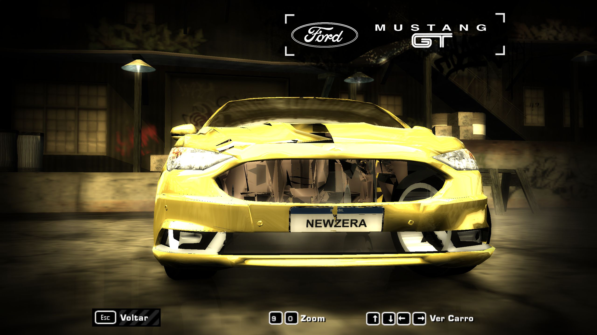

# Aprendizado: lanternas e faróis do Fusion 2018 no MW2005

**Atualização vigente:** a imagem de 2010 foi substituída por um atlas renderizado
das peças 3D da fonte de 2018. Veja
[Texturas a partir da fonte de 2018](TEXTURAS_LUZES_FONTE_2018.md) para prévias,
procedimento, hashes instalados e limites. O comando padrão de reconstrução
agora usa esse atlas; `-DonorAtlas` seleciona o resultado histórico abaixo.

O restante deste documento conserva o aprendizado da correção inicial de opacidade.

Atualizado em 20/09/2026. Versão V2, catálogo Mustang Shelby, slot MUSTANGGT.

## Resultado observado

As lanternas traseiras passaram a aparecer preenchidas, inclusive os segmentos
na tampa do porta-malas. Depois, os dois faróis principais foram reconstruídos,
recompilados e instalados. Na inspeção frontal dentro do jogo, apareceram opacos,
com detalhe de refletor e região âmbar, sem mostrar o interior através das lentes.

Isso comprova a melhoria de exibição nas vistas inspecionadas, não a conclusão
do carro inteiro. Persistem defeitos anteriores na carroceria, grades e rodas.
O brilho dos faróis ainda é forte. Faróis de milha, acionamento das luzes,
resposta ao freio, personalização e transições de LOD em corrida não foram
validados nesta etapa. A inspeção traseira ocorreu antes da inclusão dos faróis;
as malhas traseiras foram preservadas na reconstrução posterior.

Evidência da frente da última versão instalada:



## O que foi encontrado

1. **Havia geometria descartada pelo mapeamento de peças.** O exportador geral
   classificava as lentes vermelhas GTA (shader fonte 14) em
   `KIT00_RIGHT_BRAKELIGHT_GLASS`. Esse sólido não existe no catálogo Shelby.
   Além disso, manter as lanternas do Shelby não preenche os recortes do Fusion:
   são peças de outro formato e posição.
2. **A instalação tinha duas rotas.** `CARS/MUSTANGGT` estava atualizado enquanto
   `ADDONS/CARS_REPLACE/MUSTANGGT` ainda continha outra geometria. O Mod Loader
   instalado posteriormente e o atalho com `-mod` tornavam possível carregar uma
   versão diferente. Não foi comprovado qual rota cada teste antigo carregou.
   Agora ambas recebem os mesmos BINs, com comparação de SHA-256.
3. **A textura opaca, isoladamente, não garantia a exibição.** Trocas de hash,
   alpha 255, DULLPLASTIC e camadas extras continuaram produzindo partes pretas
   ou ausentes. Foi necessário combinar malha presente, fechamento, material
   compatível, textura válida e instalação correta.
4. **O AJM original é uma referência funcional.** Foram testados no mesmo jogo
   os BINs originais do Fusion AJM3899 e uma leitura/gravação sem modificar suas
   malhas. Ambos exibiram frente, faróis, grades e rodas. Portanto, o leitor e
   gravador básicos funcionaram nesse controle. Isso não valida automaticamente
   a classificação ou conversão das malhas GTA.

## Solução que produziu resultado

- Preservar o catálogo Shelby de 78 sólidos. Exportar apenas os conjuntos de
  iluminação do Fusion 2018; não transplantar a forma das lanternas de 2010.
- Selecionar **triângulos pela posição**, pois alguns drawables GTA misturam
  lentes, indicadores e outras peças. Traseira: shaders fonte 14 e 15. Frente:
  shaders 2, 15 e 26. Esses números são índices do material GTA, não hashes MW.
- Unir vértices coincidentes, eliminar faces repetidas, recalcular normais e
  reduzir a malha por LOD. Aplicar Solidify de 3 mm com fechamento das bordas.
- Acrescentar um fundo fechado seguindo os contornos. Nas lanternas, fechar
  separadamente as partes internas e externas; uma caixa retangular grande
  não acompanha a forma do Fusion.
- Usar o par do grupo opaco funcional do AJM: shader **`0x05BC3A3C`** e textura
  **`0x4B7D95B6`**, extraída do TPK original. Alpha verificado em 255. Não foi
  isolada experimentalmente a contribuição de cada mudança; não atribuir o
  sucesso exclusivamente ao shader ou à quantidade de camadas.
- Anexar as lentes a `BASE_A/B/C/D`, cujas malhas o jogo já exibe. Os 16 slots
  antigos de farol/lanterna A–D permanecem no catálogo como triângulos mínimos,
  evitando desenhar as lentes antigas junto com as novas. A geometria existente
  de BASE é preservada, e os grupos adicionados têm índices remapeados.
- Nas lanternas, amostrar vermelho em UV `(0.70, 0.40)` e claro em `(0.80, 0.90)`.
  Nos faróis, um único texel claro fez a lente parecer uma placa branca. A versão
  seguinte projeta a região de refletores prateados do atlas sobre a lente,
  espelhada entre os lados; o indicador usa a região âmbar.
- Gerar TPK nativo **B332/RAWW**, com 16 texturas. Somente a DDS `4B7D95B6` foi
  substituída pela original AJM; as outras 15, incluindo os recursos da placa
  NEWZERA, foram preservadas. Não misturar payload RAWW com o TPK JDLZ antigo.
- Gravar geometria em layout retail: catálogo pequeno e sólidos irmãos no topo.
  Reiniciar o jogo após a instalação para carregar os novos arquivos.

## O que não repetir

Adicionar camadas por tentativa sem verificar os slots não recupera geometria
que o exportador descartou. Trocar só a textura ou declarar um shader opaco
também não comprova o resultado no motor. Transplantar a malha inteira da lanterna
AJM de 2010 deformou seu encaixe; conservar o formato de 2018 foi mais adequado.
Uma prévia Blender e a leitura estrutural do BIN não substituem a inspeção no jogo.

Os scripts `AttachDonorRearLights.cs`, `RoundTripGeometry.cs` e as saídas
`native-donor-lights.bin` são controles/experimentos, não a versão instalada.

## Como reproduzir sem acumular lentes

Com o jogo fechado, a partir da pasta do projeto:

```powershell
.\scripts\build_rear_lights_v2.ps1 -Install
```

Apesar do nome histórico, o comando agora exporta **lanternas e faróis**.
`-RearOnly` gera apenas a correção traseira. Sem `-Install`, faz a compilação e
validação em work, sem copiar para o jogo.

O fluxo é `export_fusion_rear_lights.py` → mwgc → `AttachRearLenses.cs` → leitura
independente → `prepare_fusion_rear_tpk.py` → leitura independente do TPK → backup
e instalação nas duas rotas. O exportador Blender aceita `-- --front` para os
faróis. `scripts/build.ps1` é um fluxo anterior e não reconstrói esta versão V2.

A entrada fixa é `work/fusion-rear-lenses/baseline-before-base-attachment.bin`,
dentro de V2, SHA-256
`76C1C1BBD1DA8001D6AA7C3412C1CE9042923B7ACCEB7CEB7521FD12D208296C`.
Não substituir essa entrada pela release já corrigida: isso acumularia lentes.
O script interrompe se a entrada faltar ou tiver outro hash.

## Estado instalado e preservação

- GEOMETRY: `AC4DE300C521D15A596A28045987B81D37F5206DC7457C5C5444FDF0E93BC5E2`.
- TEXTURES: `A5A7E4EAF008BE570BEBE86A8564FB349B9778F846E79AE8229867E9CFE29782`.
- Leitura independente aprovada: 78 sólidos, 142.491 triângulos somando os LODs,
  16 texturas. BASE_A tem 21.135 vértices, abaixo do orçamento de 30.000 adotado.
- Comparação com a entrada fixa: 58 sólidos idênticos; alterações restritas a
  quatro BASE e 16 slots de iluminação. Vértices e índices preexistentes em
  BASE preservados. Grade, carroceria, rodas e placa não foram remodeladas aqui.
- `source/`, `donor/` e V1 preservados. AJM foi usado como referência de material
  e textura, mantendo Shelby como base estrutural de V2.
- Retorno traseiro salvo em `work/fusion-rear-lenses/rear-pass.bin`, SHA
  `6D86BC720E1C73B47E3D43F0DB6D81730365CF113C5C8884CC46EDABB79635BE`.
- Backup imediatamente anterior ao último teste:
  `work/fusion-rear-lenses/backup-20260920-213110/`.

Os caminhos work acima são relativos a `versions/v2-mustang-shelby`.
Dados verificáveis adicionais: `release-validation.json`,
`lighting-geometry-validation.json`, `lighting-texture-validation.json` e
`lighting-scope-validation.json`, nesta pasta.
