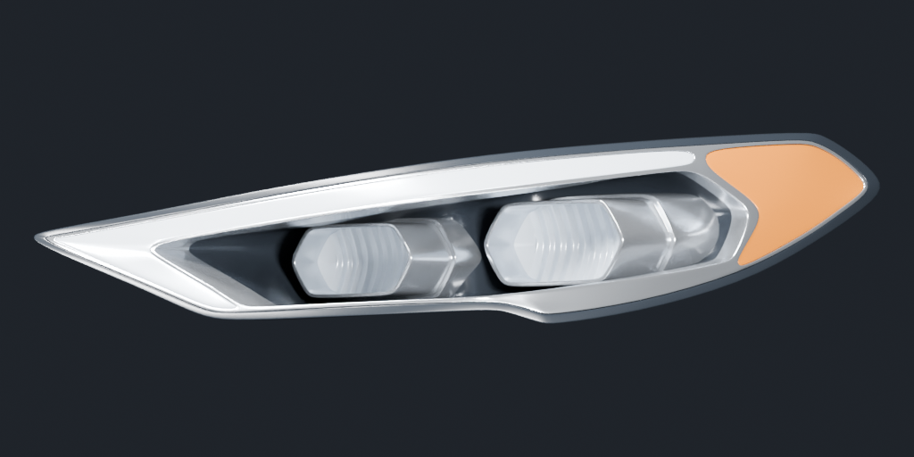
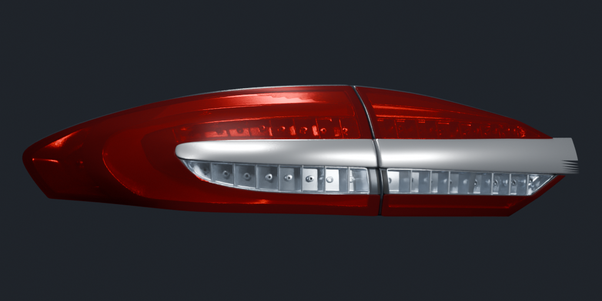
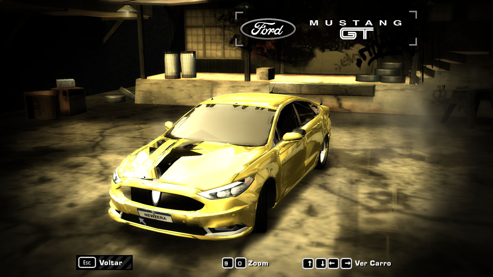

# Texturas de faróis e lanternas a partir da fonte de 2018

## Resultado atual

Foi gerado e instalado um atlas novo a partir das malhas de iluminação contidas
em `source/fusion-2017-dev/fusion/dlc.rpf`. A imagem do Fusion 2010 deixou de ser
usada na textura das lentes. O shader opaco que resolveu a exibição foi mantido.

Os dois projetores, o contorno claro e o indicador âmbar do farol vêm da geometria
da fonte. Nas lanternas, o desenho interno, a parte clara e o contorno vermelho
também vêm dessas malhas. A aparência dos materiais GTA foi aproximada em Blender
para produzir uma imagem estática; não é uma reprodução completa dos shaders GTA.





## Por que extrair a DDS não bastava

A fonte não inclui uma fotografia pronta de cada conjunto óptico. Seus detalhes
estão modelados em 3D, principalmente nos grupos de cromo e emissores. As imagens
de lente são quase uniformes:

| Textura fonte | Dimensões | Conteúdo observado |
| --- | --- | --- |
| glassfar | 128 × 128 | RGB preto, alpha 98 |
| vermelho12 | 8 × 8 | RGB 132/0/0, alpha entre 178 e 193 |
| laranjaseta | 8 × 8 | Cor âmbar e transparência |

Transformar `glassfar` em opaco produziria uma lente preta, sem os projetores.
Por isso o procedimento renderiza o conjunto 3D e grava seus detalhes em textura.
A imagem `source/1edb735f-7af9-464a-877c-d016dc051256.png` foi inspecionada como
referência, mas não foi usada no atlas. Seu layout de 2010 não corresponde ao novo
mapeamento das peças. Nenhum desses arquivos fonte foi alterado.

## Como foi produzido

1. Ler as malhas previamente extraídas em `work/source-meshes`, provenientes
   de `main` e `fusion_exh_2`; aplicar o mesmo alinhamento usado na exportação.
2. Selecionar triângulos das regiões ópticas. No farol, incluir a carcaça escura,
   refletores, emissores e indicador, sem o vidro externo que ocultaria detalhes.
   Na lanterna, incluir interiores, lente vermelha e inserto claro.
3. Renderizar projeções ortográficas oblíquas para capturar as partes que se
   curvam para a lateral. Blender Cycles, 96 amostras, OptiX na RTX 3080 Ti.
   Materiais de prévia simulam cromo, lente e luz; reduzir os reflexos da lente
   traseira permitiu ver os elementos internos.
4. Montar um atlas de 1024 × 1024: farol na metade superior, lanterna na inferior.
   Converter para DDS DXT3, com alpha 255 em todos os pixels.
5. Calcular UVs das lentes com as mesmas bases de projeção das câmeras, usando
   `abs(y)` para espelhar entre os lados. As faces, fechamentos e LODs opacos
   da etapa anterior permanecem; a alteração nas novas lentes é seu mapeamento UV.
6. Substituir apenas a textura de hash `4B7D95B6`; manter shader `05BC3A3C`,
   as outras 15 texturas e o TPK B332/RAWW. Recompilar GEOMETRY e TEXTURES,
   instalar nas duas rotas e reiniciar o jogo.

## Verificações e limites

- Leitura independente: 78 sólidos, 142.491 triângulos somando os LODs, 16 texturas.
- DDS extraída do TPK tem pixels idênticos à DDS gerada, inclusive alpha 255.
  O leitor normaliza alguns bytes de cabeçalho; comparar somente o hash do
  arquivo DDS inteiro daria um falso erro de conteúdo.
- UVs compiladas conferidas contra as projeções: erro numérico menor que
  0,000001. Prévia feita com o BIN e a DDS lidos de volta confirma o encaixe.
- 58 sólidos permanecem idênticos à entrada fixa; vértices e índices anteriores
  de BASE foram preservados. BASE_A continua com 21.135 vértices.
- No jogo, a frente mostrou os dois projetores e o contorno do novo farol.
  A traseira mostrou os elementos claros e vermelhos novos, mas ainda há
  superfícies escuras e interferências visuais no modelo. Não declarar o carro
  inteiro perfeito nem atribuir todos esses defeitos à textura.
- Não foram validados corrida, transições de LOD e acionamento dinâmico das luzes.
  Trata-se de aparência estática gravada na textura. O brilho muda com o material
  e a iluminação do MW. Ajustes finos de intensidade e aparência seguem possíveis.



## Reconstrução e retorno

Na pasta do projeto, com o jogo fechado:

```powershell
.\scripts\build_rear_lights_v2.ps1 -Install
```

O comando agora renderiza a fonte, monta o atlas, exporta lanternas e faróis,
valida e instala. `-SkipBake` reutiliza as projeções/imagens de trabalho existentes;
só usar quando a fonte e o script de renderização não tiverem mudado.
`-DonorAtlas` reconstrói o visual anterior de 2010 para comparação ou retorno.

Scripts novos: `bake_source_lamp_textures.py`, `pack_source_lamp_atlas.py` e
`preview_source_lamp_uv.py`. O último renderiza somente a leitura de volta das
lentes compiladas; não muda a instalação.

Backup do resultado anterior, incluindo os scripts antigos:
`versions/v2-mustang-shelby/work/source-lamp-bake/checkpoint-*`.
V1, source/, donor/ e a placa NEWZERA permanecem preservados.

Arquivos atualmente instalados nas duas rotas e na release:

- GEOMETRY: `F349903F7565E4BAE9A70359D0F0587C7843A56E1A4C6BD67FA8981E39F6FCC9`.
- TEXTURES: `563B585F4FBC3D0C85E22DA12E35037621040B4A0E505626BA478BD13B557CE9`.

O atlas para consulta está em
[fusion2018-lamps-atlas.png](source-lighting/fusion2018-lamps-atlas.png).
`source-lighting/projection.json` registra câmeras, grupos fonte e GPU;
`source-lighting/atlas-report.json` registra formato e procedência;
`release-validation.json` registra os arquivos instalados e limites do teste.
